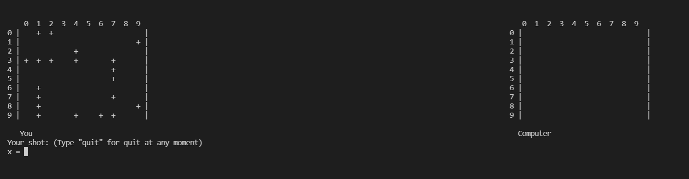

# **Морской бой**
> Игра "Морской бой" с компьютером на консоли

## **Правила игры**
С правилами стандартной версии игры вы можете ознакомиться [здесь](https://ru.wikipedia.org/wiki/%D0%9C%D0%BE%D1%80%D1%81%D0%BA%D0%BE%D0%B9_%D0%B1%D0%BE%D0%B9_(%D0%B8%D0%B3%D1%80%D0%B0)).

В этой версии игры вы можете выбрать произвольный размер игрового поля (но не менее, чем 5х5, и не более, чем 10х10), количество и размеры кораблей будут рассчитываться автоматически для введенных параметров.

## **Запуск игры**

Для этого введите в командной строке:
```
python .\battleship\ 10 10
```
где первое число - это длина поля, а второе - высота. Перед запуском рекоммендую проверить, достаточны ли размеры окна консоли для игры.

Дальше перед вами должно появиться главное меню игры:

>

Просто выберите одну из них и нажмите соответствующий символ на клавиатуре:
```
p - для запуска новой игры
q - для выхода из приложения
s - чтобы сохранить текущую игру
l - для загрузки сохраненной ранее игры
```
При запуске игры перед вами появится 2 карты, одна - ваша, заполненная кораблями случайным образом (неповрежденный корабль на карте обозначен символами `"+"` ), и карта противника - компьютера (пустая, со скрытыми на ней кораблями).



Далее вы можете делать выстрелы по карте противника, вводя координаты и нажимая `Enter`. Если выстрел нанесен мимо, то на карте противника появляется символ `"."` и ход переходит к противнику, иначе - `"x"` и вы можете нанести следующий выстрел. Когда корабль будет полностью потоплен, прямоугольная область вокруг него автоматически заполняется точками. Точно такие же изменения происходят и с вашей картой при выстрелах противника.


При некорректном вводе над картами появляется сообщение об ошибке. В этом случае просто повторите ввод заново, исправив ошибку.

Чтобы выйти из игры, просто напишите `quit` вместо любой из координат и вы сразу же попадете в главное меню, где вы можете сохранить эту игру, нажав `s`, при успешном сохранении сверху появится сообщение.

>

Игра заканчивается также в случае победы одного из игроков. В этом случае также происходит переход в главное меню, и появляется сообщение о победе.

>

## **Архитектура кода**

Я создала отдельные классы FleetMap, Fleet, Ship, Player и BattleShip. 

+ Класс `Ship` хранит необходимую информацию о корабле (его начальные координаты, направление, размер и количество произведенных по нему выстрелов). В классе реализованы методы, которые позволяют получить все координаты корабля, сделать выстрел и узнать, потоплен ли корабль.

+ Класс `Fleet` хранит словарь из всех входящих во флот кораблей, в котором ключ - это координата корабля, а значение - корабль. В нем реализованы методы добавления корабля во флот и получения корабля из флота по заданным координатам.

+ Класс `FleetMap` хранит информацию о карте в виде ячеек двумерного массива. В нем реализованы методы по работе с картой, в том числе ее заполнение и генерация строки для отображения карты на экране.

+ Класс `Player` хранит информацию об игроке в виде его имени и привязывает к нему карту. Также этот класс позволяет установить оппонента для игрока.

+ Класс `BattleShip` отвечает за игру. В нем создаются 2 игрока и устанавливаются их взаимосвязи между ними. В этом классе реализованы методы перехода хода, определения победителя и генерация строки для игрового дисплея.

`__main__.py` отделен от вышеперечисленных классов и отвечает за ввод данных пользователем и отображение игровой логики в виде информации на экране терминала.

## **Требования**

+ Python 3.7+
+ [Typer](https://github.com/tiangolo/typer)
+ [Curses](https://docs.python.org/3.7/howto/curses.html)
+ Pickle
